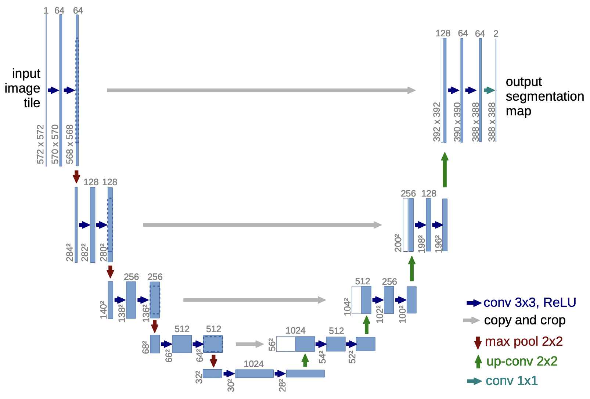

# U-Net Image Segmentation Project

## 项目简介
本项目实现了基于 U-Net 的图像分割模型，用于处理 Carvana 数据集的车辆分割任务。项目使用 PyTorch 框架，支持 MPS/CUDA/CPU 设备训练。

## 目录结构
```
.
├── input
│   └── Carvana
│       ├── train
│       ├── train_masks
│       ├── val
│       └── val_masks
├── output
│   ├── checkpoints
│   └── saved_images
├── dataset.py
├── model.py
├── train.py
└── utils.py
```

创建目录结构命令：
```bash
mkdir -p input/Carvana/{train,train_masks,val,val_masks} output/{checkpoints,saved_images} && touch input/Carvana/{train,train_masks,val,val_masks}/.gitkeep output/{checkpoints,saved_images}/.gitkeep
```

## 主要功能

### 数据处理
- 支持 jpg 格式的原始图像和 gif 格式的掩码图像
- 使用 Albumentations 进行数据增强
- 实现训练集和验证集的自动划分
- 图像预处理：调整大小、标准化等

### 模型架构
- 实现标准 U-Net 架构
- 支持可配置的输入通道和特征层
- 使用 BatchNorm 和 ReLU 激活函数
- 包含跳跃连接和上采样模块


*Olaf R., Philipp F., Thomas B. (2015). U-Net: Convolutional Networks for Biomedical Image Segmentation.*

### 训练功能
- 支持多设备训练（MPS/CUDA/CPU）
- 实现梯度缩放和自动混合精度训练
- 支持模型检查点保存和加载
- 包含训练过程可视化

### 评估指标
- 像素级准确率
- Dice 系数评估
- 支持预测结果可视化保存

## 使用说明

### 环境要求
- Python 3.8+
- PyTorch 2.0+
- Albumentations
- Pillow
- NumPy

### 数据准备
1. 在 `input/Carvana/train` 目录下放置训练图像
2. 在 `input/Carvana/train_masks` 目录下放置对应的掩码
3. 运行训练脚本自动划分验证集

### 训练过程
1. 配置 `train.py` 中的超参数
2. 运行训练脚本：`python train.py`
3. 模型检查点保存在 `output/checkpoints` 目录下
4. 预测结果保存在 `output/saved_images` 目录下

## 注意事项
- 确保数据集格式正确（jpg和gif）
- 根据设备类型自动选择训练设备
- 可通过修改超参数调整训练过程

## 许可证
[MIT License](https://opensource.org/licenses/MIT)

## 致谢
感谢以下项目和资源对本项目提供的帮助：
- [Carvana Image Masking Challenge](https://www.kaggle.com/competitions/carvana-image-masking-challenge/overview)
- [PyTorch UNet with Submission](https://www.kaggle.com/code/vladivashchuk/pytorch-unet-with-submission)
- [Pytorch-UNet](https://github.com/milesial/Pytorch-UNet)
- [U-Net: Convolutional Networks for Biomedical Image Segmentation](https://arxiv.org/abs/1505.04597)
